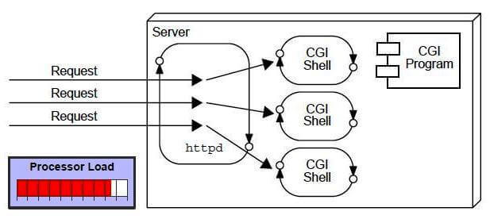

# Web application

- A `web application` is an application accessible from the web.
- A `web application` is composed of web components like:
    - Servlet
    - JSP
    - Filter
    - Etc and other elements such as HTML, CSS, and JavaScript

??? Servlet or CGI?

## CGI (Common Gateway Interface)

CGI technology enables the web server to call an external program and pass HTTP request information to the external
program to process the request.

For each request, it starts a new process.

### Disadvantages of CGI

(There are many problems in CGI technology):

- If the number of clients increases, it takes more time for sending the response.
- For each request, it starts a process, and the web server is limited to start processes.
- It uses platform dependent language e.g. C, C++, perl.

## Servlet Definitions

- Servlet technology is used to create a web application
- Servlet is an interface that must be implemented for creating any Servlet.
- Servlet is a class that extends the capabilities of the servers and responds to the incoming requests. It can respond
  to any requests.
- Servlet is a web component that is deployed on the server to create a dynamic web page.

Servlet is an interface.

Input: ServletRequest
Output: ServletResponse

Impls of Servlet:

* HttpServlet
* GenericServlet

### Why Servlet?

- There are many advantages of Servlet over CGI
- The __web container__ creates __threads__ for handling the __multiple requests__ to the Servlet.
- Threads have many benefits over the Processes such as :
    - they share a common memory area, lightweight
    - cost of communication between the threads are low
- __Better performance__: because it creates a thread for each request, not process.
- __Portability__: because it uses Java language.
- __Robust__: JVM manages Servlets, so we don't need to worry about the memory leak, garbage collection, etc.
- __Secure__: because it uses java language.

## Web Terminology

### 1. Website
- Website is a collection of related web pages that may contain text, images, audio and video.
- Website is hosted on one or more servers and can be accessed by visiting its homepage using a computer network.

#### - Static Website
#### - Dynamic Website

### 2. HTTP (Hyper Text Transfer Protocol)
- The HTTP is __application-level protocol__ for collaborative, distributed, hypermedia information systems.
- HTTP is __TCP/IP__ based communication protocol.
- HTTp default port is TCP 80.
- It allows web servers and browsers to exchange data over the web.
- It is a request response protocol.
- It uses the __reliable TCP__ connections by default on TCP __port 80__.
