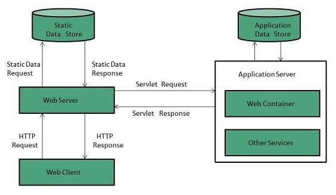

# Server: Web vs. Application

There are two types of servers:

1. Web Server
2. Application Server

## 1. Web Server

- A web server is primarily responsible for __serving static content__, such as HTML pages, images, CSS files, and JavaScript scripts. 
- It acts as a _gateway_ between _web clients_ (browsers) and the _backend systems_ where the application's data resides.
- When a user requests a URL, the web server retrieves the corresponding static file from the application's file system and sends it back to the browser.
- Examples of Web Servers are: __Apache__ , __Nginx__ and __Resin__.

### Key characteristics of a web server:

- Handles _static_ content delivery
- Responds to HTTP requests
- Operates on the _application layer_ of the OSI model
- Efficient in retrieving and sending static files

### Web Server Working
It can respond to the client request in either of the following two possible ways:

1. Generating response by using the script and communicating with database.
2. Sending file to the client associated with the requested URL.

## 2. Application Server
The Example of Application Servers are:
1. JBoss: Open-source server from JBoss community.
2. Glassfish: Provided by Sun Microsystem. Now acquired by Oracle.
3. Weblogic: Provided by Oracle. It more secured.
4. Websphere: Provided by IBM.

Application Server:

An application server goes beyond serving static content and handles dynamic content, which is generated based on user interactions or data requests. It acts as a bridge between the web server and backend databases, business logic, and other enterprise services. The application server's primary responsibility is to process user requests, execute server-side logic, and generate dynamic responses.

Key characteristics of an application server:

Processes dynamic content
Executes server-side logic
Handles database interactions
Supports authentication, authorization, and session management
Enables scalability and load balancing