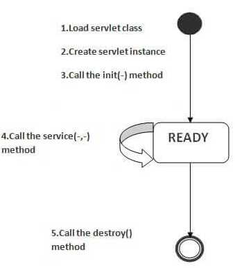
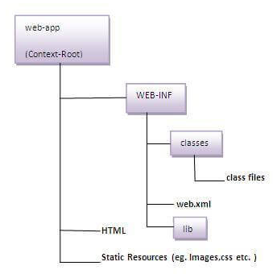
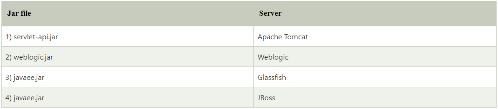

# Servlet API

- __javax.servlet__ package: Interfaces and classes that are used by the servlet or web container. These are not
  specific to any protocol.

- __javax.servlet.http__ package: Interfaces and classes that are responsible for http requests only.

### Interfaces in javax.servlet package

1. Servlet
2. ServletRequest
3. ServletResponse
4. RequestDispatcher
5. ServletConfig
6. ServletContext
7. SingleThreadModel
8. Filter
9. FilterConfig
10. FilterChain
11. ServletRequestListener
12. ServletRequestAttributeListener
13. ServletContextListener
14. ServletContextAttributeListener

### Classes in javax.servlet package

1. GenericServlet
2. ServletInputStream
3. ServletOutputStream
4. ServletRequestWrapper
5. ServletResponseWrapper
6. ServletRequestEvent
7. ServletContextEvent
8. ServletRequestAttributeEvent
9. ServletContextAttributeEvent
10. ServletException
11. UnavailableException

### Interfaces in javax.servlet.http package

1. HttpServletRequest
2. HttpServletResponse
3. HttpSession
4. HttpSessionListener
5. HttpSessionAttributeListener
6. HttpSessionBindingListener
7. HttpSessionActivationListener
8. HttpSessionContext (deprecated now)

### Classes in javax.servlet.http package

1. HttpServlet
2. Cookie
3. HttpServletRequestWrapper
4. HttpServletResponseWrapper
5. HttpSessionEvent
6. HttpSessionBindingEvent
7. HttpUtils (deprecated now)

# Servlet Interface

- __Servlet interface__ needs to be implemented for creating any servlet.
- It provides 3 life cycle methods:
    1. To initialize the servlet: `public void init(ServletConfig config)`
        - Invoked by the web container only once.
    2. To service the requests: `public void service(ServletRequest request,ServletResponse response)`
        - Provides response for the incoming request.
        - It is invoked at each request by the web container.
    3. To destroy the servlet: `public void destroy()`
        - Invoked only once and indicates that servlet is being destroyed.
- It provides 2 non-life cycle methods:
    1. Get servlet config: `public ServletConfig getServletConfig()`
    2. Get servlet Info: `public String getServletInfo()    `
        - returns information about servlet such as writer, copyright, version etc.

# GenericServlet

- GenericServlet class implements __Servlet__, __ServletConfig__ and __Serializable__ interfaces.
- GenericServlet class can handle any type of request so it is __protocol-independent__.

# HttpServlet

- __HttpServlet__ class extends the __GenericServlet__ class and implements Serializable interface.
- It provides http specific methods such as __doGet__, __doPost__, __doHead__, __doTrace__ etc.

## Methods of HttpServlet class

- `public void service(ServletRequest req,ServletResponse res)`
    - Dispatches the request to the protected service method by converting the request and response object into http
      type.
- `protected void service(HttpServletRequest req, HttpServletResponse res)`
    - Receives the request from the service method, and dispatches the request to the doXXX() method depending on the
      incoming http request type.
- `protected void doGet(HttpServletRequest req, HttpServletResponse res)`
    - Handles the GET request. It is invoked by the web container.
- `protected void doPost(HttpServletRequest req, HttpServletResponse res)`
    - Handles the POST request. It is invoked by the web container.
- `protected void doHead(HttpServletRequest req, HttpServletResponse res)`
    - Handles the HEAD request. It is invoked by the web container.
- `protected void doOptions(HttpServletRequest req, HttpServletResponse res)`
    - Handles the OPTIONS request. It is invoked by the web container.
- `protected void doPut(HttpServletRequest req, HttpServletResponse res)`
    - Handles the PUT request. It is invoked by the web container.
- `protected void doTrace(HttpServletRequest req, HttpServletResponse res)`
    - Handles the TRACE request. It is invoked by the web container.
- `protected void doDelete(HttpServletRequest req, HttpServletResponse res)`
    - Handles the DELETE request. It is invoked by the web container.
- `protected long getLastModified(HttpServletRequest req)`
    - Returns the time when HttpServletRequest was last modified since midnight January 1, 1970 GMT.

# Life Cycle of a Servlet (Servlet Life Cycle)

1. Servlet class is loaded.
2. Servlet instance is created.
3. `init` method is invoked.
4. `service` method is invoked.
5. `destroy` method is invoked.

### Servlet States

1. new
2. ready
3. end



# Creating Servlet

The servlet can be created by three ways:

1. By implementing Servlet interface,
2. By inheriting GenericServlet class, (or)
3. By inheriting HttpServlet class

## Apache tomcat server example. The steps are as follows:

1. Create a directory structure
    
    

2. Create a Servlet
3. Compile the Servlet 
   1. Different Servers provide different jar files:
      
      Put the java file in any folder. After compiling the java file, paste the class file of servlet in WEB-INF/classes directory.
4. Create a deployment descriptor
  ```
<web-app>
    <servlet>  
        <servlet-name>sonoojaiswal</servlet-name>  
        <servlet-class>DemoServlet</servlet-class>  
    </servlet>  

    <servlet-mapping>  
        <servlet-name>sonoojaiswal</servlet-name>  
        <url-pattern>/welcome</url-pattern>  
    </servlet-mapping>  
</web-app>  
```

- `<web-app>` represents the whole application.
- `<servlet>` is sub element of <web-app> and represents the servlet.
- `<servlet-name>` is sub element of <servlet> represents the name of the servlet.
- `<servlet-class>` is sub element of <servlet> represents the class of the servlet.
- `<servlet-mapping>` is sub element of <web-app>. It is used to map the servlet.
- `<url-pattern>` is sub element of <servlet-mapping>. This pattern is used at client side to invoke the servlet.
5. Start the server and deploy the project 
   1. To start Apache Tomcat server, double click on the startup.bat file under apache-tomcat/bin directory.
      Access the servlet
   